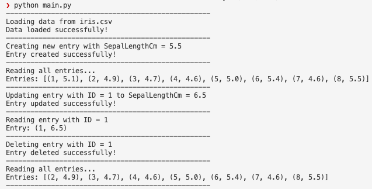

# README 

This repository features the materials for the Iris Dataset Project. It includes:
- A SQLite database file.
- Python scripts for CRUD operations.
- Libraries for data loading and operations.
- (If applicable) GitHub Actions.

# Purpose Of Project
The purpose of this project is to demonstrate CRUD operations on the Iris dataset. The dataset "iris.csv" is loaded into a `.db` file, and operations are performed using SQLite.
Dataset attributes: "SepalLengthCm"

# Preparation 
1. Clone the project to your local machine.
2. Install necessary Python packages using `requirements.txt`.

# Check Format & Errors
1. `make format`
2. `make lint`
3. Run tests using: `python test_main.py`

# CRUD Operations
### Main Functions in `main.py`
- `load_iris(dataset="iris.csv")`: Loads the data from the "iris.csv" file into the SQLite database.
- `create_iris_entry(sepal_length)`: Creates a new iris data entry.
- `read_all_iris_entries()`: Reads all iris data.
- `read_iris_entry_by_id(entry_id)`: Reads an iris entry by its id.
- `update_iris_entry(id, sepal_length)`: Updates an iris entry by its id.
- `delete_iris_entry(id)`: Deletes an iris entry by its id.

### Running CRUD Examples: 
- Load data: `load_iris("iris.csv")`
- Create a new entry: `create_iris_entry(5.5)`
- Read all entries: `read_all_iris_entries()`
- Update entry with id=1: `update_iris_entry(1, 6.5)`
- Read entry with id=1: `read_iris_entry_by_id(1)`
- Delete entry with id=1: `delete_iris_entry(1)`

# Output
Detailed logs will be printed to the console, showing the results of each operation. For instance:
- "Data loaded successfully!"
- "Entry created successfully!"
- "Entry updated successfully!"
- "Entry deleted successfully!"

# Screenshot or log of successful database operations

Week 5: Python Script interacting with SQL Database
Requirements
- Connect to a SQL database
- Perform CRUD operations
- Write at least two different SQL queries
Grading Criteria
- Database connection (20 points)
- CRUD operations (20 points)
Deliverables
- Python script
- Screenshot or log of successful database operations
